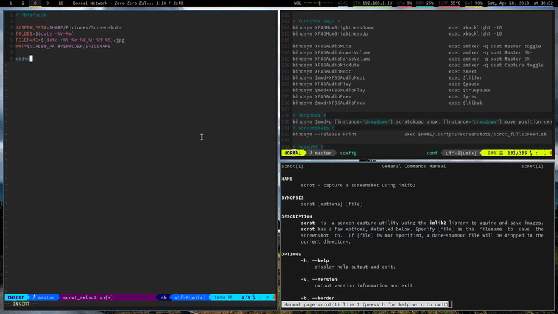
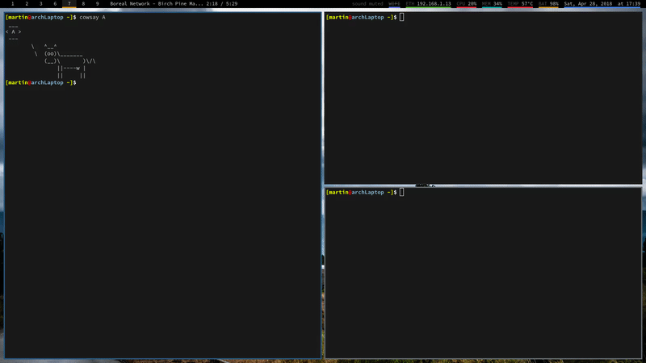
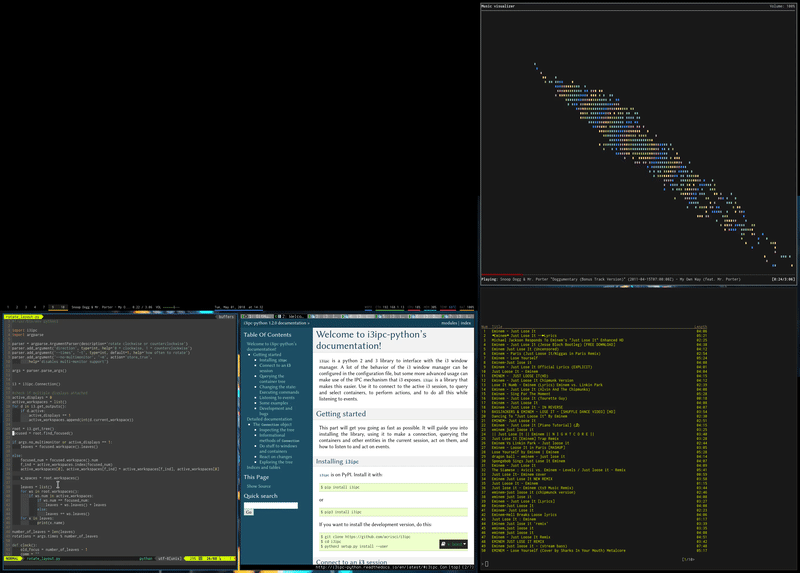
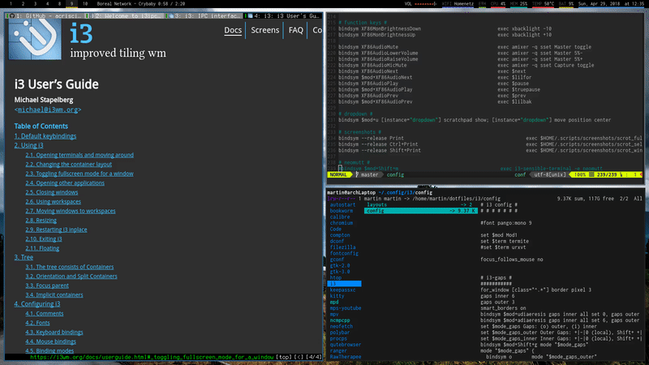

# i3-tools
Small scripts to extend the [i3wm](https://i3wm.org/) window manager. For requirements see `Pipfile` and `Pipfile.lock`.

## rotate_layout.py ##
A script to rotate the current layout clockwise or counterclockwise. This
script also supports multiple monitors. This can also be turned off (see
usage).
#### Dependencies ####

 * [i3ipc](https://github.com/acrisci/i3ipc-python) : `pip install --user i3ipc`

#### Usage ####
`rotate_layout.py [-h] [--times TIMES] [--no-multimonitor] direction`

 * direction:
   * 0 : clockwise
   * 1 : counterclockwise
 * -h : help
 * --times/-t N: rotate N times
 * --no-multimonitor/-m: disables multimonitor support

#### Examples ####







#### Note ####

* Performance might be slow with a lot of containers.
* This script might not work for every layout according to the [i3wm User's Guide](https://i3wm.org/docs/userguide.html#_swapping_containers):
     > Note that swapping does not work with all containers. Most notably, swapping floating containers or containers that have a parent-child relationship to one another does not work.
* The script doesn't know how your monitors are set up so things might get
    confusing if you use more than 2 displays.

## fullscreen_mode.py ##
A script to switch to different containers in fullscreen mode. This can also be done with `rotate_layout.py` but is significantly faster because no containers are swapped around (and the layout stays as is).

#### Dependencies ####

 * [i3ipc](https://github.com/acrisci/i3ipc-python) : `pip install --user i3ipc`

#### Usage ####
`fullscreen_mode.py [-h] [--times N] direction`

 * direction:
   * 0 : backwards
   * 1 : forwards
 * -h : help
 * --times/-t N: move N times forwards/backwards

#### Examples ####



## on_workspace_init.py ##
A script to execute a command once a specific workspace is created.

#### Dependencies ####

 * [i3ipc](https://github.com/acrisci/i3ipc-python) : `pip install --user i3ipc`

#### Usage ####

```
on_workspace_init.py [-h] [ws_cmd [ws_cmd ...]]
```

* ws_cmd: ws_name,program_name


##### Example usage #####
Add a line like this to your i3 config file:

```
exec --no-startup-id on_workspace_init.py "$ws7","firefox" "$ws8","code" "$ws9","termite -e 'ncmpcpp -s visualizer'"
```

or something like this:

```
exec --no-startup-id on_workspace_init.py --no-exec "$ws10","append_layout ~/.config/i3/layouts/internet_overload.json; exec chromium; exec qutebrowser; exec firefox"
```

## auto_scratchpad.py ##
A script to automatically move a window matching certain criteria to the scratchpad upon focus loss

#### Dependencies ####

 * [i3ipc](https://github.com/acrisci/i3ipc-python) : `pip install --user i3ipc`

#### Usage ####

```
auto_scratchpad.py [-h] criteria [criteria ...]
```

* criteria: floating,name,class_name,instance,role,mark
    * floating: True or False
    * name: window name
    * class_name: class of window
    * instance: instance of window
    * role: role of window
    * mark: mark of window

##### Example usage #####
Add a line like this to your i3 config file:

```
exec_always --no-startup-id auto_scratchpad.py True,,,dropdown,, True,,,dropdown2,,
```

To automatically move:

 * a floating window with `instance = dropdown`
 * a floating window with `instance = dropdown2`

to the scratchpad upon focus loss.


## auto_orientation.py ##
A script to automatically change the orientation depending on the focused window's width and height.

#### Dependencies ####

 * [i3ipc](https://github.com/acrisci/i3ipc-python) : `pip install --user i3ipc`

#### Usage ####

Add this to your i3 config:

```
exec_always --no-startup-id /path/to/script/auto_orientation.py
```

## focus_outermost_parent.py ##
A script to focus the outermost parent.

#### Dependencies ####

 * [i3ipc](https://github.com/acrisci/i3ipc-python) : `pip install --user i3ipc`

#### Usage ####

Add this to your i3 config:

```
bindsym $mod+Up exec --no-startup-id focus_outermost_parent.py
```
